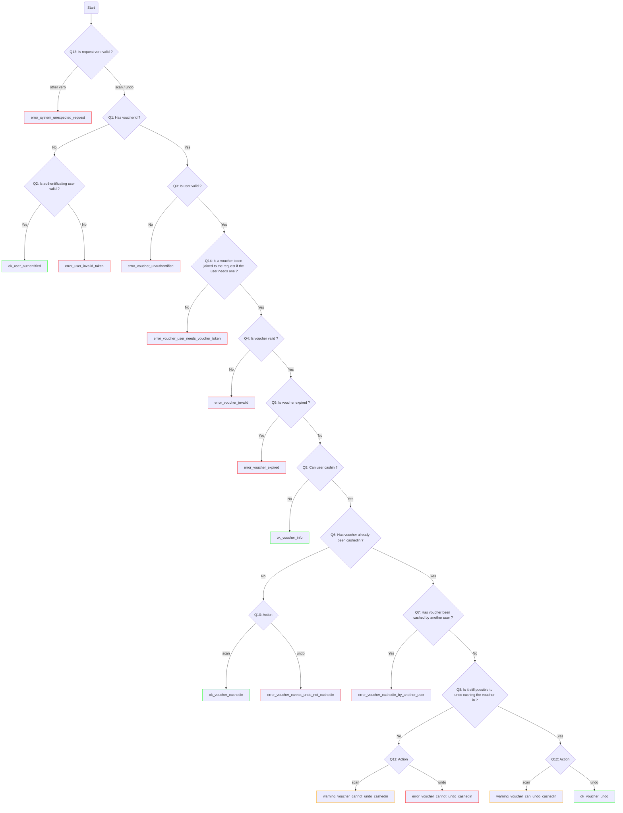

# Épicerie Le Détour Vouchers System

## Request / Response chart



## Develop

### Dependencies

- python>=3.7
- jq
- sqlite3
- pdfunite
- qrencode


### Run the server

```sh
# Install
python -m python3 venv
venv/bin/activate
python -m pip install -e . -r requirements.txt

# Test
pytest

# Serve
python -m uvicorn app.main:app --reload --host 0.0.0.0 --ssl-keyfile ssl/ca.key --ssl-certfile ssl/ca.pem --ssl-keyfile-password nopasswd --env-file dev.env
```

### Genereate SSL certificate

```sh
cd ssl
openssl genrsa -des3 -out ssl/ca.key 2048
openssl req -x509 -new -nodes -key ca.key -sha256 -days 1825 -out ssl/ca.pem
```

## WIP operations

### File a table

1. Create a stub CSV file with `python bin/generate_stub_table.py`
2. Edit the CSV by hand
3. Import it to the db with

```
sqlite3 db.sqlite3
> .import --csv --skip 1 --schema temp data.csv table_name
```
